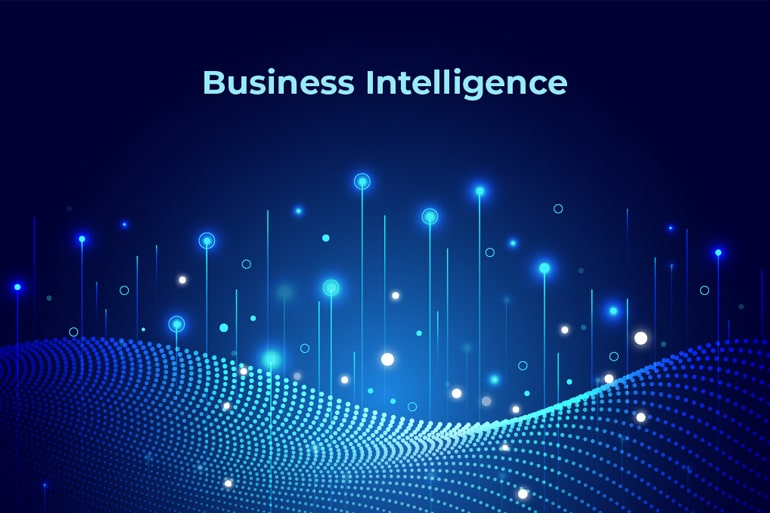

# INTELIGENCIA DE NEGOCIOS

En este `repositorio` se encuentran temas relacionados a **inteligencia de negocios** tales como:

1. Obtencion de datos de diferentes fuentes de informacion.
2. Modelado Dimencional.
3. Creacion de pipelines con ETL.
4. Identificacion de KPI.
5. Visualizacion de los Datos mediante Dashboards.
6. Implementacion del proceso de forma automatica.

Herramientas a utilizar:

`Sistemas Gestores de Bases de Datos`
- Microsoft SQL SERVER
- Postgres
  
`ETL`
- Microsoft SQL Integration Services (SSIS)
- Pentahoo

`Visualizacion`
- Microsoft Power BI
- Tableu

`Contenedores`
- Docker Desktop y Docker Engine
- Docker Compose

`Automatizacion de Tareas`
- Jobs
- Store Procedure para Backups

